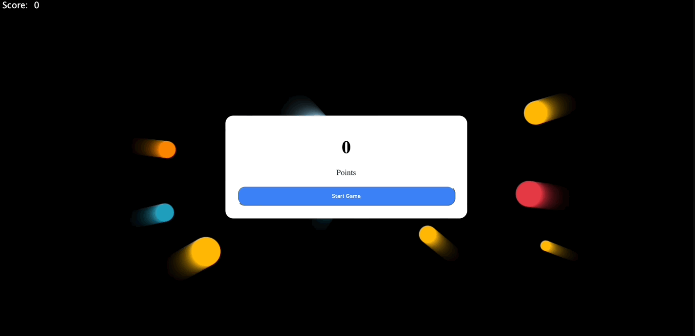

# DodgeBallz

[DodgeBalls](https://github.com/daneelsan/DodgeBalls) implemented in zig.

This mini game shows how Zig, WASM, Javascript and HTML5 canvas can interact.

In particular, there are lots of back and forth between imported and exported wasm functions.
Among those imported functions are functions that draw things on a canvas, e.g. `arc` or `strokeRect`.



## Build

To build the wasm module, run:

```shell
$ zig build game -Drelease=true --verbose

$ ls game.*
game.o    game.wasm (7.2K)
```

## Run

Start up the server in this repository's directory:

```shell
python3 -m http.server
```

Go to your favorite browser and type to the URL `localhost:8000`. You should see the checkboard changing colors.

## TODOs

-   Find a better way to debug from the wasm module. I used a lot of `console.log` to debug, but given that we can only pass a limited set of types between JS and WASM (e.g. `i32` or `f32`), this was tedious. Perhaps there is a way to write a zig `Writer` that writes into the console.

-   Of course, there are many improvements to the game. The score could be made to depend on the size of the enemy, the number of enemies could increase depending on the score achieved, etc.

## Resources

-   https://github.com/daneelsan/DodgeBalls
-   https://github.com/daneelsan/minimal-zig-wasm-canvas
